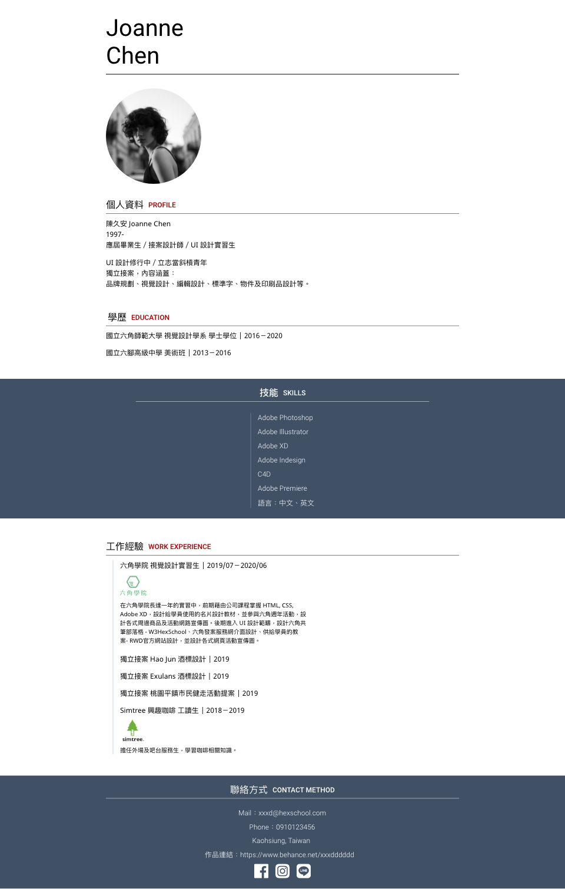

### 新手切版任務的啦
本關任務設計稿
[Adobe XD 下載網址](https://xd.adobe.com/view/0f1c0abb-4063-4ed0-96b1-452f520f878b-5a4f/)(僅供有參加體驗營授權同學)

設計稿與圖片操作教學
可觀看 作業設計稿 - 線上預覽操作教學
線上網址圖片，這裡六角已經上傳到[圖片空間](https://github.com/hexschool/webLayoutTraining1st)，本次作業圖片都放在 week1 資料夾，網址如下，其他以此類推：
+ https://hexschool.github.io/webLayoutTraining1st/week1/photo.png
+ https://hexschool.github.io/webLayoutTraining1st/week1/line.svg

補充：如果不知道怎麼找到圖片路徑請點我

繳交任務內容需含以下二點
您的 Slack 暱稱
作業網址：請透過 Codepen 或 GitHub Pages 提交作業，以方便助教與講師檢視

設計稿如下圖:

